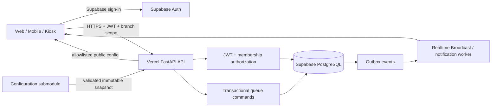
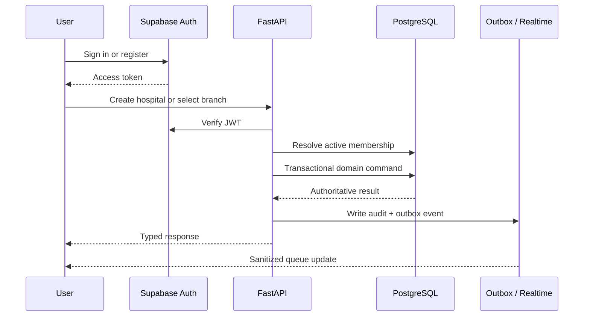

# MediQueue

> A modular healthcare queue platform for hospitals, branches, staff, and patients.

[](https://mediqueue-backend-eta.vercel.app/)
[](https://supabase.com/)
[](https://vercel.com/)
[](docs/architecture.md)

MediQueue coordinates patient flow from authentication and hospital setup to
appointments, visits, queue tokens, and staff-facing operations. The main
repository is an integration shell; production code is maintained in pinned
child repositories.

## Platform at a glance

| Surface | Responsibility | Status |
| --- | --- | --- |
| `mediqueue-backend` | FastAPI API, identity, scheduling, queues, migrations, worker | Implemented |
| `mediqueue-configuration` | JSON Schema-validated release snapshots and public allowlist | Implemented |
| `mediqueue-frontend` | Sinhala/English public website, registration, login, password recovery and account access | Public/auth foundation implemented; role workspaces next |
| `docs/` | Architecture, technology decisions, and repository rules | Maintained |

## Full request and data flow



### Core lifecycle



## Repository layout

```text
MediQueue/
├── backend/          # FastAPI submodule: API, migrations, tests, worker
├── configuration/    # JSON configuration submodule and schema validator
├── frontend/         # Next.js public website and authentication submodule
├── docs/             # Architecture and technology decisions
├── assets/            # Shared brand assets
└── .github/           # Integration CI
```

## Quick start

### Clone the complete project

```powershell
git clone --recurse-submodules https://github.com/ChamathDilshanC/mediqueue.git
Set-Location MediQueue
```

### Run the backend locally

```powershell
Set-Location backend
python -m pip install -e '.[test]'
Copy-Item .env.example .env
python -m backend.init_db
python -m uvicorn backend.main:app --reload
```

Open the local documentation:

- API portal: <http://127.0.0.1:8000/docs>
- Swagger: <http://127.0.0.1:8000/swagger>
- ReDoc: <http://127.0.0.1:8000/redoc>
- OpenAPI: <http://127.0.0.1:8000/openapi.json>

### Validate configuration

```powershell
python configuration\validate.py configuration\defaults.json
python configuration\validate.py configuration\development.json
python configuration\validate.py configuration\staging.json
python configuration\validate.py configuration\production.json
```

## Public operational endpoints

| Endpoint | Purpose |
| --- | --- |
| [`/health`](https://mediqueue-backend-eta.vercel.app/health) | Liveness check; no database query |
| [`/health/ready`](https://mediqueue-backend-eta.vercel.app/health/ready) | PostgreSQL readiness check using `SELECT 1` |
| [`/status`](https://mediqueue-backend-eta.vercel.app/status) | Public service status |
| [`/v1/config/public`](https://mediqueue-backend-eta.vercel.app/v1/config/public) | Allowlisted browser-safe configuration |
| [`/docs`](https://mediqueue-backend-eta.vercel.app/docs) | Branded API documentation portal |

## Technology stack

| Layer | Technology | Why it is used |
| --- | --- | --- |
| API | Python, FastAPI, Pydantic | Typed HTTP contracts and generated OpenAPI |
| Persistence | Supabase PostgreSQL | Durable multi-tenant source of truth |
| Data access | SQLAlchemy async + Alembic | Async transactions and controlled migrations |
| Authentication | Supabase Auth + JWT/JWKS | Managed identity with verifiable tokens |
| Authorization | Database memberships | Tenant and branch isolation independent of user claims |
| Queue reliability | PostgreSQL locks + idempotency keys | Safe concurrent check-in and call-next commands |
| Events | PostgreSQL outbox | Transactionally consistent notifications and realtime updates |
| Configuration | JSON Schema snapshots | Immutable, validated, allowlisted release settings |
| Web client | Next.js, React, TypeScript | Bilingual public/auth experience; role-based hospital interfaces planned |
| Deployment | Vercel + GitHub submodules | Independently deployable services with pinned integration commits |
| Quality | pytest, integration tests, GitHub Actions | Regression, isolation, and concurrency coverage |

## Production database

For Vercel, use the Supabase **Session Pooler** URL on port `5432`:

```text
postgresql://postgres.<project-ref>:PASSWORD@aws-0-<region>.pooler.supabase.com:5432/postgres?sslmode=require
```

URL-encode password characters such as `@` → `%40`. Do not use the direct
`db.<project-ref>.supabase.co:5432` host for Vercel unless IPv6 connectivity is
available. Keep `DATABASE_URL`, service-role keys, JWT secrets, and OAuth
credentials in Vercel environment variables only.

## Documentation map

- [Architecture](docs/architecture.md)
- [Technology stack](docs/TECH_STACK.md)
- [Backend API and operations](backend/README.md)
- [Frontend foundation](frontend/README.md)
- [Configuration releases](configuration/README.md)

## Development principles

- PostgreSQL is authoritative in production; SQLite is local-only.
- Every scoped mutation validates tenant, branch, membership, and role.
- Queue mutations are transactional, idempotent, audited, and outbox-backed.
- Public configuration exposes only values listed by `publicAllowlist`.
- Secrets never belong in source control, frontend bundles, or logs.
