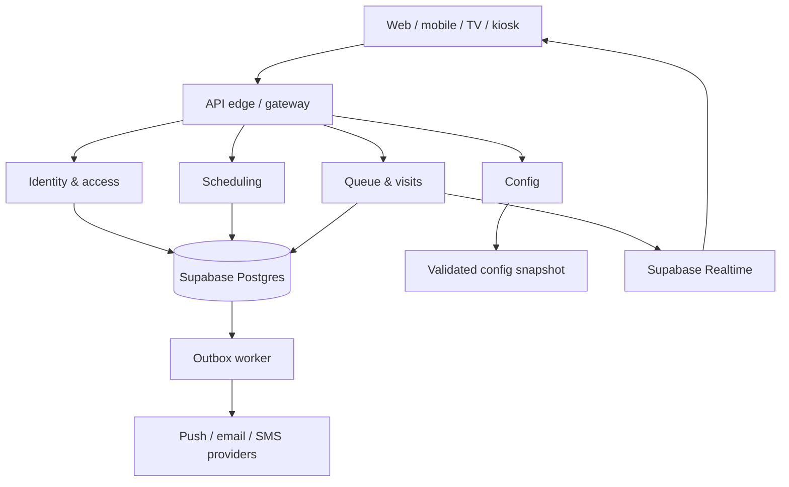

# MediQueue — System Architecture

**Status:** proposed architecture · **Version:** 1.0 · **Date:** 2026-09-28

**Product:** Multi-branch healthcare queue and patient-flow platform. Web first, mobile later.
**Stack:** Next.js/TypeScript; Python/FastAPI services; Supabase PostgreSQL, Auth, Realtime and Storage; SQLAlchemy/Alembic.

### Implemented API slice (2026-09-28)

The current backend deploys identity, scheduling and queue routers together as a modular FastAPI application, with schema ownership retained (`iam`, `scheduling`, `queue`, `notifications`). The independently deployed services below remain the target topology; this slice uses local cross-schema transactions for onboarding and reference validation rather than claiming service isolation already exists.

Implemented entities: hospitals (the existing `iam.tenant`), branches, Supabase-linked user profiles, branch memberships, departments, rooms, doctors, schedules, reference-only patients, visits, appointments and queue tokens. Hospital onboarding creates the first branch and admin membership atomically. JWTs establish identity; active database memberships establish role/branch scope. Public signup never accepts role or tenant metadata. Existing users need memberships provisioned when upgrading from claim-only authorization.

Setup entities have typed, scoped CRUD. Hospitals/branches have onboarding/read/update operations; membership revocation is explicit. Appointment cancellation and immutable visit/audit history preserve records rather than exposing blanket deletion. Patient references are shared within a hospital; other operational resources are branch-scoped. Outbox and idempotency storage remain internal. Schedule overlap and appointment capacity are checked under branch/schedule locks. Queue commands use actor/branch/operation-bound idempotency, row locks, audit and outbox records. The local SQLite adapter persists schema sidecars but is not a concurrency substitute for PostgreSQL.

The API reference at `/docs` is a responsive white/lime portal generated from `/openapi.json`; Swagger remains available at `/swagger`. The frontend submodule is unchanged. Invitations, patient self-service, public TV credentials, visit-stage transfers, realtime fanout delivery and analytics remain the later stages identified below, not exposed as placeholder endpoints in this release.

## 1. Architectural decisions

- Four Git repositories: `mediqueue` (main), `mediqueue-frontend`, `mediqueue-backend`, `mediqueue-configuration`. Repository display names may be “MediQueue — Main/Frontend/Backend/Configuration”; Git slugs must be distinct.
- The main repo pins the other three as Git submodules. A main-repo commit is a reproducible combination of frontend, backend, and configuration commits. Each child repo has its own CI; integration and deployment run from the main repo.
- Backend is a **service-based system within one backend repo**. Start with three independently deployable FastAPI services and one Python worker; split additional domains only when operational needs justify it. No shared write access to another service's tables.
- Supabase PostgreSQL is the durable source of truth. Redis is not needed initially. Supabase Realtime broadcasts sanitized queue events; clients refetch authoritative API state after reconnect.
- Configuration repo owns versioned, non-secret application configuration. CI validates and publishes an immutable snapshot; the Config service serves it to authorized clients. Secrets live in deployment secret stores, never in Git or browser responses.
- A patient emergency is handled by clinical staff through normal clinical procedures; queue priority is an administrative scheduling rule and does not perform triage.

## 2. Repository topology

```text
mediqueue/                         # Main / integration / deployment repo
├── .gitmodules
├── architecture.md
├── README.md
├── frontend/                     # submodule → mediqueue-frontend
├── backend/                      # submodule → mediqueue-backend
├── configuration/                # submodule → mediqueue-configuration
├── deploy/
│   ├── compose.local.yml
│   ├── docker/
│   └── environments/
└── .github/workflows/
    ├── integration.yml
    └── deploy.yml

mediqueue-frontend/
├── apps/web/                     # Admin, reception, doctor, patient, TV, kiosk
├── packages/ui/                  # shared design system
├── packages/api-client/          # generated from versioned OpenAPI
└── tests/

mediqueue-backend/
├── services/
│   ├── identity-access/          # auth verification, membership and RBAC
│   ├── scheduling/               # doctors, sessions, appointments
│   ├── queue/                    # visits, tokens, queue transitions
│   ├── notifications-worker/     # async delivery, retries
│   └── config/                   # validated config snapshot API
├── packages/
│   ├── contracts/                # event schemas and OpenAPI outputs
│   ├── observability/            # logs, traces, metrics
│   └── platform/                 # shared infrastructure adapters only
├── db/migrations/                # owner-tagged migrations
└── tests/

mediqueue-configuration/
├── schemas/                      # JSON Schema + compatibility rules
├── defaults/
├── environments/{development,staging,production}/
├── tenants/                      # branch overrides, no patient data
├── public/                       # allowlisted browser-safe config
└── README.md
```

Submodule URLs are actual Git remote URLs established when the four repos exist. Suggested commands (replace `<org>`):

```bash
git submodule add https://github.com/<org>/mediqueue-frontend.git frontend
git submodule add https://github.com/<org>/mediqueue-backend.git backend
git submodule add https://github.com/<org>/mediqueue-configuration.git configuration
git clone --recurse-submodules https://github.com/<org>/mediqueue.git
git submodule update --init --recursive
```

Workflow: change and merge a child repo → pass its own checks → update its pinned commit in main → run integration checks → deploy the exact main commit. Protect all default branches; pin production releases by Git SHA/image digest, not a moving branch. CI checkout must enable submodules and have read access to private repos. Avoid pushing directly from a detached submodule HEAD; work on a branch in its own repo. Configuration is a submodule for release reproducibility. Vercel build automation must initialize the pinned `configuration/` submodule and package its validated snapshot into the deployment; it is **not a production runtime Git dependency**.

## 3. Runtime view



The edge handles TLS, request IDs, rate limits and routing. It verifies Supabase Auth JWTs; each service independently enforces authorization for sensitive mutations. Web and future mobile use the same versioned HTTP APIs and event contracts. Never embed a Supabase service-role key or database credentials in frontend/mobile code.

| Component | Owns | Deployment boundary |
| --- | --- | --- |
| Identity & access | tenant/branch memberships, roles, invitations, authorization policy | FastAPI HTTP service |
| Scheduling | doctors, rooms, sessions, appointment slots and booking policy | FastAPI HTTP service |
| Queue & visits | check-in, visit stages, tokens, call/recall/skip/transfer/complete, ETA read model | FastAPI HTTP service |
| Notifications worker | outbox consumption, templates, provider delivery and retries | Python worker |
| Config service | validated versioned snapshot, authenticated/public views, ETag | FastAPI HTTP service |

Analytics initially reads dedicated reporting views/aggregates from PostgreSQL; move it to a separate service when load requires it. Each service owns a distinct PostgreSQL schema (`iam`, `scheduling`, `queue`, `notifications`); restrict database roles per schema. Shared physical Supabase project keeps initial costs manageable, although it is not physical database isolation. Cross-service access uses APIs/events, not direct writes into foreign schemas. Migrations are owned and backward compatible.

## 4. Core data and queue invariants

`tenant → branch → department → doctor → session`; `patient → visit → visit_stage → queue_token`; `appointment → visit` is optional. Queue scope is a branch + service/doctor + session (depending on service). A patient may have consecutive visit stages, each with its own queue token; preserve history across transfers.

- Token uniqueness: `(tenant_id, branch_id, queue_id, business_date, token_number)` unique. Allocate numbers transactionally in PostgreSQL; never derive them from `COUNT(*)` or Redis.
- `POST /v1/queues/{id}/tokens` and call-next accept an idempotency key. Store key, actor, scope and result; retries return the same outcome.
- Call-next acquires a row lock for the queue/session, selects eligible waiting tokens using explicit priority + appointment policy + arrival order, changes exactly one token to `CALLED`, writes an audit event and outbox event, then commits. Concurrent doctors cannot call the same token.
- Define a state machine: `WAITING → CALLED → IN_SERVICE → COMPLETED`; allowed side paths `CALLED → RECALLED/NO_SHOW`, `WAITING → CANCELLED/TRANSFERRED`, and controlled restoration. Every transition checks role, expected version and tenant/branch scope. No direct client writes to queue tables.
- Priority changes require actor, reason and timestamp. Include fairness limits so regular patients are not starved; emergency override has explicit authorization and audit.
- Store timestamps in UTC and branch IANA timezone; business date is calculated in the branch timezone. Show ETA as a range based on recent consultation durations and live queue state, never as a guarantee.
- Use database constraints, transactions and indexes before caching. A queue event is emitted after commit via an outbox. Consumers deduplicate by event ID and can replay/rebuild read models.

## 5. API and realtime contracts

Representative HTTP endpoints:

```text
POST /v1/appointments
POST /v1/visits/check-in
GET  /v1/queues/{queueId}/snapshot
POST /v1/queues/{queueId}/call-next
POST /v1/tokens/{tokenId}/recall
POST /v1/tokens/{tokenId}/skip
POST /v1/tokens/{tokenId}/transfer
POST /v1/tokens/{tokenId}/complete
GET  /v1/config/public?branchId=...
GET  /v1/config/staff?branchId=...
```

Every command validates input, identity, tenant scope, branch membership and permitted transition. Responses include `requestId` and version where applicable. OpenAPI and event JSON Schemas are generated/tested in backend CI; frontend uses a generated typed client. Version breaking changes through `/v2` or compatible migration windows.

Broadcast after commit to scoped channels such as `branch:{id}:display` and `queue:{id}:staff`. Public events contain **token display label, room and queue status only**; never patient name, phone, NIC, diagnosis or appointment detail. Staff/patient channels require Realtime Authorization policies. Sequence/version and an initial snapshot handle missed or reordered events; refresh on reconnect. Use Supabase Broadcast for event fanout, not raw subscriptions to sensitive tables. At very small MVP scale Postgres Changes can be considered, with explicit access tests and a later move to Broadcast.

## 6. Configuration repo contract

The configuration repo contains **policy and presentation data**, not executable code or credentials. Examples: appointment windows, queue priority weights and fairness thresholds, no-show grace period, feature flags, supported languages, TV layout, service hours, message-template IDs, API compatibility version. Separate environment and tenant/branch overrides; define precedence `defaults < environment < tenant < branch`. Restrict which keys may be overridden per branch.

```json
{
  "schemaVersion": 1,
  "configVersion": "2026-09-28.1",
  "queue": {
    "recallLimit": 2,
    "noShowGraceSeconds": 120,
    "maxPriorityStreak": 3
  },
  "display": { "languages": ["si", "en", "ta"] }
}
```

**Publish and fetch flow:**

1. Configuration PR passes JSON Schema, semantic rules, environment diff, security scan and approval. No secrets or patient records enter Git.
2. Main repo pins its config commit. Release CI merges overrides, signs/hashes the artifact, and publishes an immutable snapshot with `configVersion`, schema version and commit SHA to a protected artifact store or deployment image.
3. Config service starts from that snapshot, verifies checksum/schema and caches the last known good version. It exposes only allowlisted browser-safe values from `/v1/config/public`; staff settings require tenant-aware authorization. Backend services load their own policy config locally or from the authenticated Config service, cache with TTL/ETag and keep last known good on an outage.
4. Web app fetches public config during startup and refetches by ETag when notified; sensitive policy evaluation stays server side. Mobile uses the same endpoint later. Queue actions do not depend on a live Git provider or public config endpoint.
5. A config rollout is staged, versioned and auditable. Invalid values reject the release. Rollback means redeploying a previously approved snapshot/main commit. For urgent operational changes use an admin-controlled, audited override stored server side with expiry, then reconcile into Git.

Examples of secrets outside the repo: Supabase service credentials, JWT verification material, database connection strings, Resend/SMS keys, signing keys. Browser receives only a public Supabase URL/anon key when needed, never elevated credentials. Keep API URL and public feature flags in the allowlist.

## 7. Security, privacy and reliability

- Supabase Auth issues identities; backend verifies tokens and maps them to tenant/branch roles. Database RLS is defense in depth for any direct authorized client access, not a substitute for backend checks. Default-deny policies and automated cross-tenant access tests are release gates.
- Public TV/kiosk screens use limited display credentials and short sessions; patient lookup uses a scoped, unguessable token and throttling. Minimize personal data in logs and events. Define retention/deletion and consent requirements with the deploying healthcare organization and local legal review.
- Encrypt transport, use managed at-rest protection, secret rotation, least-privilege service accounts, dependency scans and signed release artifacts. Audit access to patient data and every queue override; do not store clinical notes in this queue product unless scope and governance are explicitly expanded.
- Set health/readiness endpoints, structured logs with request IDs, metrics (p95 command latency, conflict rate, queue lag, delivery failure), traces and alerting. Configure backup/PITR according to Supabase plan and perform restore drills. Define RPO/RTO and an offline reception fallback before live clinical rollout.
- Notification delivery is best effort with retry/dead-letter handling; a failed SMS must not roll back a committed queue transition. Idempotent providers and event consumers prevent duplicate messages where supported.

## 8. Environments, CI/CD and release

Development, staging and production have separate Supabase projects, credentials and deployment settings. Never share production patient data with lower environments. Local Compose can run FastAPI services plus a local Supabase stack or development project. Vercel hosts the FastAPI HTTP services as Python serverless functions and the frontend as a Next.js deployment. The Vercel build initializes the exact configuration submodule commit, validates the snapshot and packages it with the release. Each API deployment runs migrations as a controlled release job before new traffic. The notification/outbox worker runs separately as a managed worker or scheduled job; it must not depend on a Vercel request remaining alive. Choose the worker platform after measuring cost, region, availability and operational limits.

CI gates: lint/typecheck/unit tests per repo; migration and concurrency tests for queue; contract tests between services/frontends; tenant isolation checks; config schema validation; integration smoke test against pinned submodule commits. Release sequence: compatible database migration → backend services/worker → frontend → config activation. Keep old API/event versions during rolling deployment and have a rollback plan for schema changes.

## 9. Delivery plan

| Stage | Deliverable |
| --- | --- |
| 0 | Create four remote repos, branch rules, submodules, README, Docker/local environment and CI |
| 1 | Auth/RBAC, tenant/branch setup, doctor schedules, queue transaction engine, audit and basic web admin/reception/doctor dashboards |
| 2 | TV display, patient portal, Broadcast events, no-show/transfer flows, notification worker |
| 3 | Appointment integration, multi-stage flow, analytics, ETA and kiosk |
| 4 | Expo mobile app against the same APIs; load, accessibility, privacy and disaster-recovery validation |

**First usable vertical slice:** receptionist checks in patient → doctor calls next → TV updates → patient sees queue position → audit records the transition. Implement this end to end before expanding service count or adding AI/Redis.

## 10. Decisions to settle before implementation

1. Git organization/account and whether repos are private; CI needs cross-repo read access.
2. Single clinic vs multi-tenant SaaS at launch; tenant isolation remains in the schema either way.
3. Country/region for hosting and data residency, notification provider and operational budget.
4. Exact appointment-versus-walk-in priority policy, fairness rules and staff override permissions.
5. Whether patient medical records are out of scope (recommended for first release).

## Reference documentation

- Git submodules: https://git-scm.com/docs/git-submodule
- Supabase Realtime Broadcast: https://supabase.com/docs/guides/realtime/broadcast
- Supabase Realtime authorization: https://supabase.com/docs/guides/realtime/authorization
- FastAPI deployment: https://fastapi.tiangolo.com/deployment/
